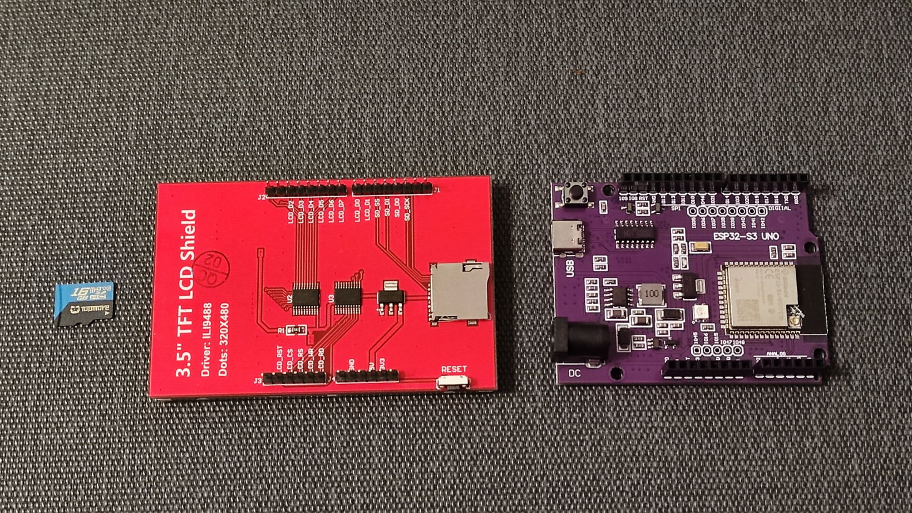
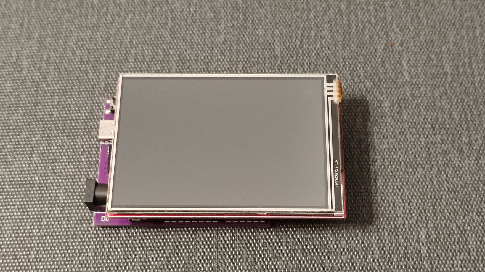
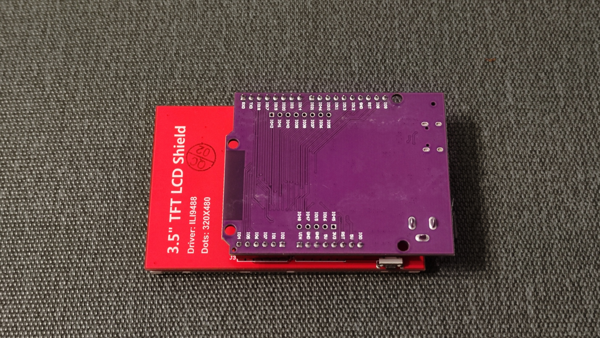
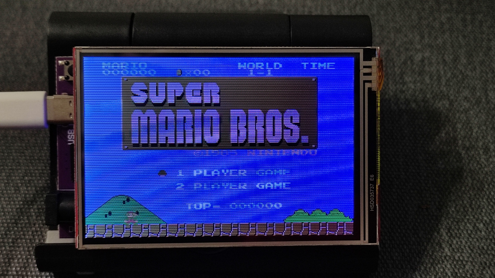

# ESP32-S3_Uno-nofrendo

This is a quick-connect NES emulator project that utilizes the ESP32-S3 UNO development board paired with an ILI9488 8-bit parallel LCD shield. Simply align and attach the two modules together, eliminating the need for complex SPI wiring and reducing the time spent debugging potential wiring errors. By using this plug-and-play approach, you can get started with the project more efficiently.

Before turning on the machine, please store the NES game ROMs on the SD card.

## Known Issues

Currently, only screen display functionality is provided, and support for joysticks and audio effects is not yet available. Perhaps you could assist in implementing Bluetooth joystick or audio effect support, which would help make this project more comprehensive and complete.

https://www.youtube.com/watch?v=SOmtnB1wlSQ
